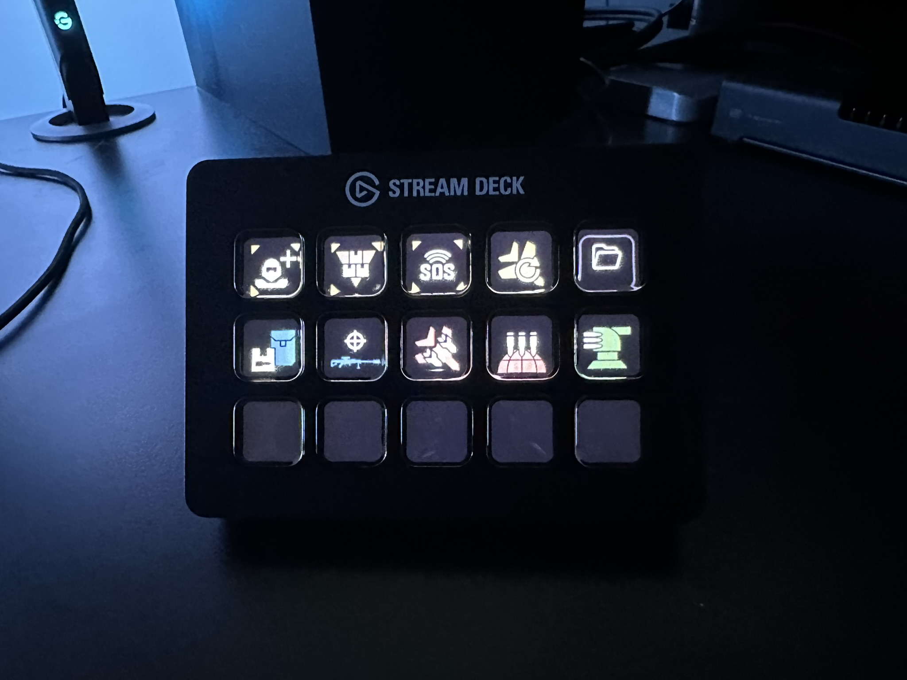
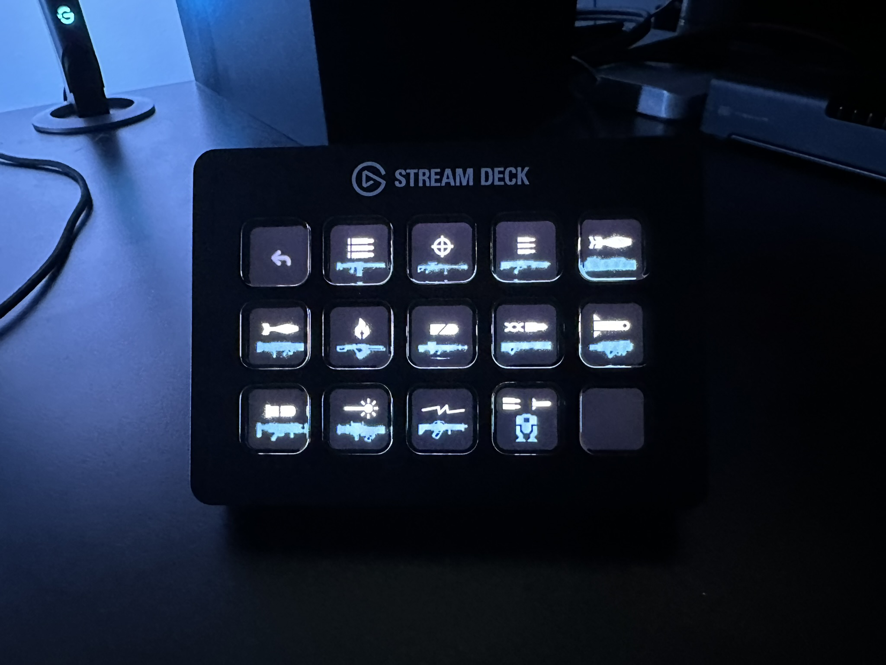
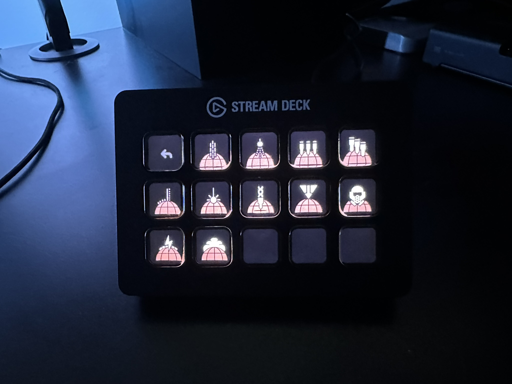

# Deckmaster Helldivers 2

Allows a user to use the CTRL-ARROW stratagem commands with an Elgato Stream Deck.

## Requirements

- [Deckmaster](https://github.com/muesli/deckmaster)
- `xdotool` which will work for Xorg users, and is required for Wayland since games tend to run in Xwayland

## Images

## Icons

Thanks to the following for their icons:

- https://github.com/nvigneux/Helldivers-2-Stratagems-icons-svg for their Helldivers 2 svgs
- https://github.com/cdemetriadis/lovely-streamdeck-icons for their handy generic icons

# FAQ

Q. Why not use deckmaster's built in key inputs and define it in the yaml?

A. At least on my setup (Wayland/Hyprland) they don't reach the game window, thus a script which calls `xdotool`.
